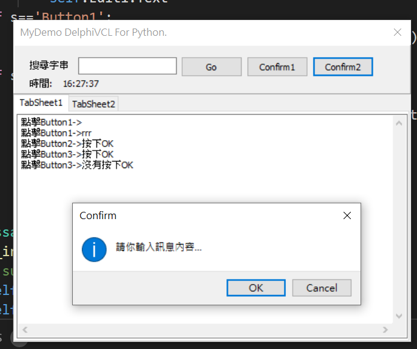

# MyDelphiVcl for python

## 參考網址:
[pythongui.org](https://pythongui.org/python-for-delphi-vcl-vs-tkinter/)
[pyscripter](https://github.com/pyscripter/python4delphi)

---

# 執行結果:

[https://www.youtube.com/watch?v=dH8frEgfmRQ](https://www.youtube.com/watch?v=dH8frEgfmRQ)

# 程式碼:
[source code](MyDelphiVcl/)
---

